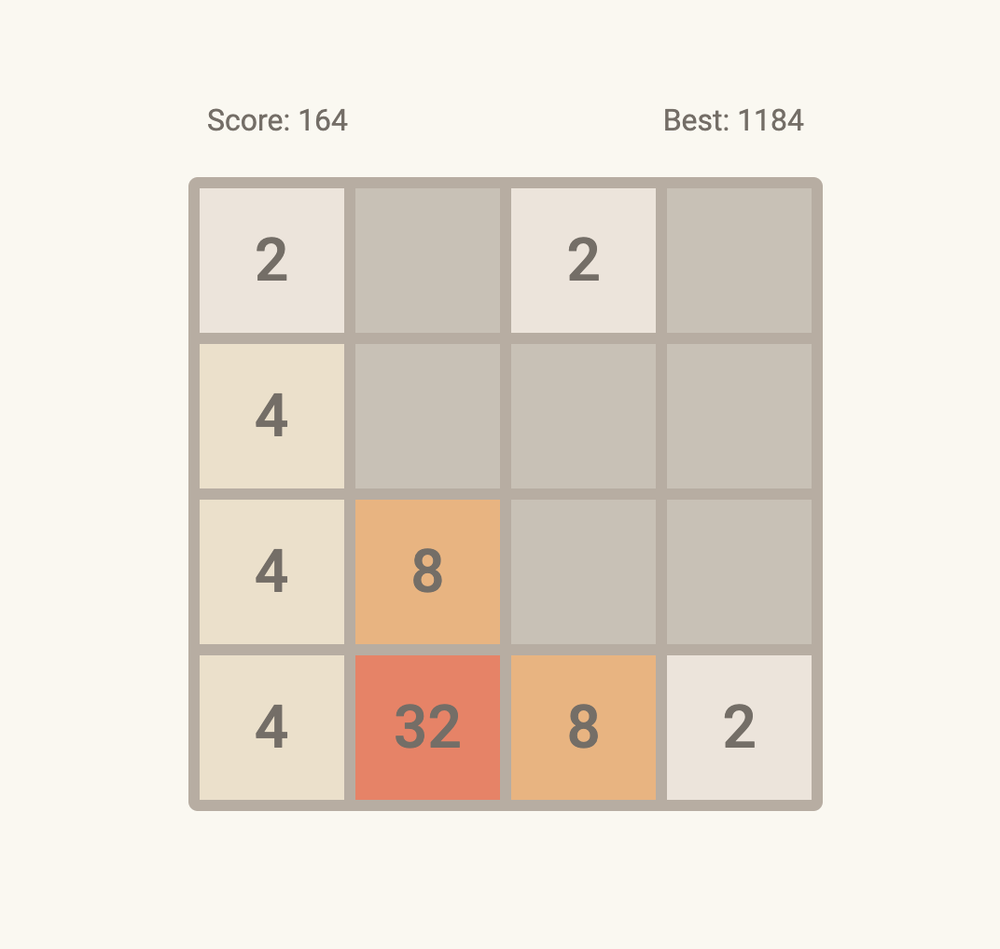

<h1 align="center">2048</h1>

> Developed in [Vanilla JavaScript](https://www.javascript.com/), [HTML](https://www.w3schools.com/html/) & [CSS](https://www.w3schools.com/css/)

<!--  -->

    

## Contents

-   [Project Configuration](#1-project-configuration)

---

### 1. Project Configuration

-   JavaScript: 1.5
